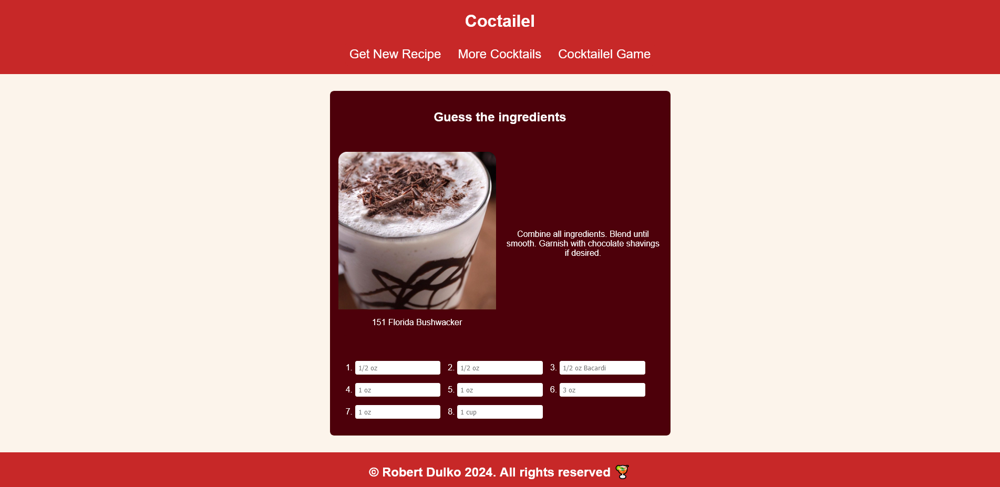

# Coctailel - Website about cocktails

Cocktail ingredient guessing game and a database for cocktail recipes. Inspired by the [TheCocktailDB](https://www.thecocktaildb.com/api.php) and games such as Wordle, Rankdle and such.

This was created as a practice for making more complex websites, that utilize external data fetching, more complex logic (like a game).

## Preview



## Client-side game logic implementation 

No secret that a game that processes game data client-side could lead to giving players an unfair advantage. Anyone who is just a little bit knowledgeable in JavaScript can extract game data to cheat. It's the reason why games where integrity is important keep their game logic somewhere on a remote backend server. Client-side should only receive relative information that needs to be displayed to the player. Client-side also only sends what the user did on client-side - clicked on a screen, button; pressed a certain button, etc. 

That is why this game is easy to cheat. It's important to mention that this is only a practice project. All of the logic, could be easily transferred to the backend, and the user would just receive relative data about the game state through an API. This would increase applications integrity.

## Use of `innerHTML`

From a security standpoint, as stated in the [MDN article](https://developer.mozilla.org/en-US/docs/Web/API/Element/innerHTML), it's always safer to use `textContent`, as it's used to set text inside a node. `InnerHTML` can be used not only to set text, but also generate HTML code. When an `innerHTML` is set, it will remove all element's descendants and replace them with nodes that are constructed from the parsed *htmlString*. 

To demonstrate the security concerns with `innerHTML`, let's entertain a scenario. Imagine a web application, where users had an ability to post comments on a thread, that later other users retrieve and render it on their browsers. If code that handles render logic inserts text into the comment box using `innerHTML` it will generate any HTML element that the comment string may contain. This may sound nice, as it could let users format their comments with HTML markup. But there's one issue, they could also inject code. And because other users also generate HTML based on that comment string, they could potentially also run the injected code, that other users post. This obviously poses some security concerns. The code could be harmless, but usually these types of vulnerabilities are exploited to gain access to unauthorized sensitive data. In this case, it would be wiser to use `textContent`. Users that may post text including JavaScript will be assigned to the text node, which does not generate HTML code. 

It is worth noting, that it is also possible to inject code with `textContent` if the HTML element is `<script>` 

So should we avoid innerHTML like a plague and only use `textContent`? No, I believe, if users have no way of manipulating the data assigned to `innerHTML` it should do no harm. `innerHTML` can be used to generate HTML and which eases the process of creating interactive content. 

Imagine another scenario. Now we created a web application, where our users fetch blog posts from an API, but they have no way of editing blog posts themselves. Unless the blog post owner was trying to exploit it's users, then using `innerHTML` to set blog post contents is not harmful. 

This technique was implemented in this project. No user has access to post new cocktails on the CocktailDB besides the CocktailDB owners. That is why `innerHTML` is used to create paragraphs with `<span>`s that obscure certain words.

## Github pages path traversal that also works on localhost

Path traversal can be tricky with web pages hosted on Github Pages. If you have a custom domain set up with Github pages, you will probably not encounter these problems, but if you are someone like me, who has a lot of pages hosted, does not want to have one apex domain and also is not interested in buying a domain for every single project, then here are some tips for navigating with an `<a>` and programmatically through JavaScript.

### The problem

The problem with web pages hosted on Github Pages, is that the Github pages generated URL will always contain repository name as a subdirectory.

My example:

`https://overlydevoted.github.io/repository-name`

This creates some inconvenience and changes the way we usually do navigation with HTML and JavaScript. 

### Navigating with `<a>`

Using **relative** or **absolute** paths. Absolute paths are pretty self-explanatory, you just assign the whole URL to `href` attribute and it navigates well enough. 


#### Example of an absolute path:
```html
<a href="https://user.github.io/repository/subdirectory">HyperLink</a>
```

In my opinion a more elegant solution is to use **relative** path traversal. With relative paths, you can use path traversal sequences `../` for navigating through server files. Be mindful of the fact that with the content of `href`, `window.location.href` will be traversed like a folder. 

#### Example of a relative path:

Let's say you start at `https://username.github.io/games/` and you wanted to go to the root page

```html
<a href="./../">HyperLink</a>
```

or

```html
<a href="/..">HyperLink</a>
```

### Navigating programmatically with JavaScript

This is where we have to implement somewhat of a workaround. You can't use `window.location` for navigation, as even when we try to preserve repository name as a subdirectory, we still get a 404 page.

These methods do not work

`window.location.assign(url)`
`window.location.href = url`

A working workaround is to create a `<a>` with a `href` attribute to the page you may want to visit and issuing a HTML element's prototype `click()`, this will nicely navigate to the desired page.

Example: 
```javascript
const aNavigator = document.createElement("a");
aNavigator.href = `./../?parameter=${id}`
aNavigator.click(); 
```

It's worth to mention that this method could not work in some browser versions. As some browsers had this functionality only for buttons inputs. Before, Firefox also required those elements, before anything, to be attached to the DOM tree.